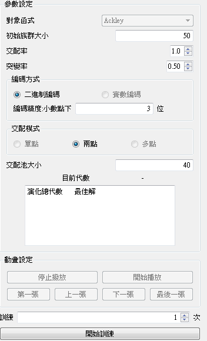

# [School Project] Genetic Algorithm
This program simulates the process which finding the best solution of the Ackley function with genetic algorithm
## Object function : Ackley function

## Configures
* Initial population size: (Dedault) 50
* Probability of performing crossover : (Dedault) 1.0
* Probability of mutation : (Dedault) 0.5
* Decode mode : binary / real
* Crossover mode : single / double / multiple
* Pooling size : (Dedault) 40

